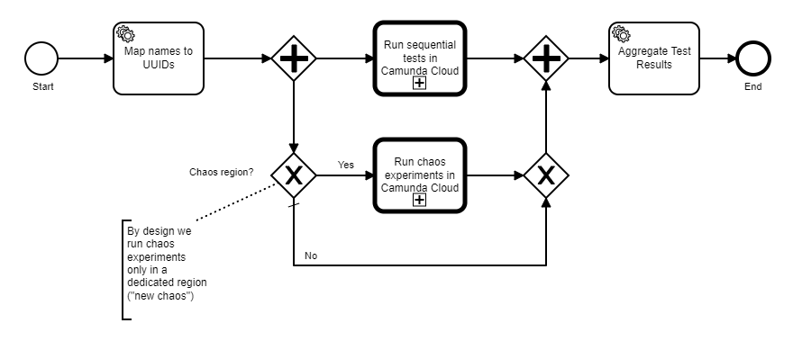
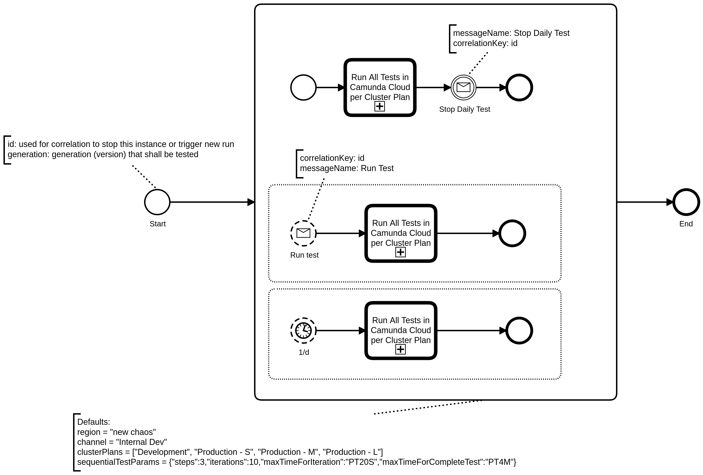

# Zeebe Cluster Testbench

Test bench to run tests against a Zeebe cluster .

### Current State
This code base is in very early stages.

## Available Documentation

* [Operator handbook](docs/operator-handbook.md)
* [Technical documentation](docs/technical-documentation.md)

## User Guide
### Tests

#### Sequential Test
In the sequential test a sequential workflow is executed several times in succession. There is at most one active workflow instance at any given time. In other words, there is no parallelism - neither inside the workflow being tested nor in the test driver that starts workflow instances.

A sequential test has the following parameters:
* _steps_ - number of steps within the workflow
* _iterations_ - number of times the workflow shall be executed
* _maxTimeForIteration_ - the maximum duration for one iteration 
* _maxTimeForCompleteTest_ - the maximum time for the entire test

This test will fail, if any of the following conditions occur:
* there is an exception during test execution
* a single iteration takes longer than _maxTimeForIteration_
* all iterations take longer than _maxTimeForCompleteTest_

In case of backpressure the iteration will be repeated. The time spent making requests that return backpressure responses and repeating those requests is included in the overall execution time, which must be smaller than _maxTimeForCompleteTest_ for the test to pass.

### Test Workflows
The testbench deploys several workflows to orchestrate the test execution. The work flows reference each other - a higher level workflow will call a lower level workflow. 
However, lower level workflows can also be called directly if only a certain test execution is wanted.

#### Run All Tests in Camunda Cloud per Cluster Plan
This workflow runs all tests in a fresh cluster in Camunda Cloud in different cluster plans:

**Workflow ID:** `run-all-tests-in-camunda-cloud-per-cluster-plan-process`
 
| Inputs | Description | Type |
| ------ | ----------- | ---- | 
| `generation` | name of the generation for the cluster | `String` |
| `clusterPlans` | names of the cluster plans for the clusters | `List<String>` |
| `channel` | name of the channel for the cluster | `String` |
| `region` | name of the region for the cluster | `String` |
| `sequentialTestParams` | Settings to parameterize the sequential test | `SequentialTestParameters` |

#### Run All Tests in Camunda Cloud per Region
This workflow runs all tests in a fresh cluster in Camunda Cloud in different regions:

**Workflow ID:** `run-all-tests-in-camunda-cloud-per-region-process`
 
| Inputs | Description | Type |
| ------ | ----------- | ---- | 
| `generation` | name of the generation for the cluster | `String` |
| `clusterPlan` | name of the cluster plan for the cluster | `String` |
| `channel` | name of the channel for the cluster | `String` |
| `regions` | names of the regions for the clusters | `List<String>` |
| `sequentialTestParams` | Settings to parameterize the sequential test | `SequentialTestParameters` |

#### Run All Tests in Camunda Cloud 
This workflow runs all tests in a fresh cluster in Camunda Cloud:

Currently, it only has steps for the _sequential test_, but this could be extended in the future.

**Workflow ID:** `run-all-tests-in-camunda-cloud-process`
 
| Inputs | Description | Type |
| ------ | ----------- | ---- | 
| `generation`/`generationUUID` (optional) | name/UUID of the generation for the cluster | `String` |
| `clusterPlan`/`clusterPlanUUID` | name/UUID of the cluster plan for the cluster | `String` |
| `channel`/`channelUUID` | name/UUID of the channel for the cluster | `String` |
| `region`/`regionUUID` | name/UUID of the region for the cluster | `String` |
| `sequentialTestParams` | Settings to parameterize the sequential test | `SequentialTestParameters` |

The cluster parameters can either be specified using human-friendly names or machine-friendly UUIDs. Both are possible and the counterpart will be found as part of the process. The generation can be omitted. In that case the channel's default generation will be used.

| Outputs | Description | Type |
| ------- | ----------- | ---- |
| `sequentialTestResult` | Test result for sequential test | `List<TestResult>` |

##### Run Sequential Test in Camunda Cloud
This workflow runs the sequential test in a fresh cluster in Camunda Cloud:

**Notes**
* The _Notify Engineers_ step is a workaround until we have user tasks

**Workflow ID:** `run-sequential-test-in-clusterplan-process`
 
| Inputs | Description | Type |
| ------ | ----------- | ---- |
| `generation` + `generationUUID` | name + UUID of the generation for the cluster | `String` |
| `clusterPlan` +`clusterPlanUUID` | name + UUID of the cluster plan for the cluster | `String` |
| `channel` + `channelUUID` | name + UUID of the channel for the cluster | `String` |
| `region` + `regionUUID` | name + UUID of the region for the cluster | `String` |
| `testParams` | Settings to parameterize the sequential test | `SequentialTestParameters` |

The cluster parameters shall be given as name and UUID. The UUIDs are used to create the cluster. The names are used for the recording of test results

| Runtime Variables | Description | Type |
| ----------------- | ----------- | ---- |
| `clusterId` | ID of the cluster in which Zeebe is tested | `String` |
| `clusterName` | Name of the cluster in which Zeebe is tested | `String` |
| `authenticationDetails` | Credentials to authenticate against the cluster | `CamundaCloudAutenticationDetails` |
| `operateURL` | URL to Operate web interface | `String` |

| Outputs | Description | Type |
| ------- | ----------- | ---- |
| `testReport` | test report | `TestReport` |
| `testResult` | test result | `TestResult` |

### Test Protocols
#### Daily Test

The daily test protocol runs all tests in all cluster plans. Tests are repeated every day, until they are stopped by sending a message to a running process instance.

| Inputs | Description | Type |
| ------ | ----------- | ---- | 
| `generation` | name of the generation for the cluster | `String` |
| `id` | id of the workflow instance, needed as correlation key when stopping the daily tests | `String` | 

The following defaults are defined in the process description:
* `clusterPlans` 
* `channel` 
* `region` 
* `sequentialTestParams` 

### Utility Workflows
Utility workflows are utilized by the test workflows to perform certain technical tasks

##### Prepare Zeebe Cluster in Camunda Cloud
This workflow creates a Zeebe cluster in Camnuda cloud and waits until the cluster is ready:

**Workflow ID:** `prepare-zeebe-cluster-in-camunda-cloud-process`
 
| Inputs | Description | Type |
| ------ | ----------- | ---- |
| `generationUUID` | UUID of the generation for the cluster | `String` |
| `clusterPlanUUID` | UUID of the cluster plan for the cluster | `String` |
| `channelUUID` | UUID of the channel for the cluster | `String` |
| `regionUUID` | UUID of the region for the cluster | `String` |

| Runtime Variables | Description | Type |
| ----------------- | ----------- | ---- |
| `clusterStatus` | Current status of the newly created cluster | `String` |

| Outputs | Description | Type |
| ----------------- | ----------- | ---- |
| `clusterId` | ID of the cluster in which Zeebe is tested | `String` |
| `clusterName` | Name of the cluster in which Zeebe is tested | `String` |
| `authenticationDetails` | Credentials to authenticate against the cluster | `CamundaCloudAutenticationDetails` |
| `operateURL` | URL to Operate web interface | `String` |

### Service Tasks

| Service Task | ID / Job Type | Input | Output | Headers |
| ------------ | ------------- | ----- | ------ | ------- |
| Map names to UUIDs | `map-names-to-uuids` / `map-names-to-uuids-job` | `channel`, `clusterPlan`, `region`, `generation`, `channelUUID`, `clusterPlanUUID`, `regionUUID`, `generationUUID` | `channel`, `clusterPlan`, `region`, `generation`, `channelUUID`, `clusterPlanUUID`, `regionUUID`, `generationUUID` |  
| Create Zeebe Cluster in Camunda Cloud | `creae-zeebe-cluster-in-camunda-cloud` / `create-zeebe-cluster-in-camunda-cloud-job` | `channelUUID`, `clusterPlanUUID`, `regionUUID`, `generationUUID` | `clusterId`, `clusterName`, `authenticationDetails` |
| Query Zeebe Cluster State in Camunda Cloud | `query-zeebe-cluster-state-in-camunda-cloud` / `query-zeebe-cluster-state-in-camunda-cloud-job` | `clusterId`, `clusterName` | `clusterStatus` |
| Gather Information about Cluster in Camunda Cloud | `gather-information-about-cluster-in-camunda-cloud` / `gather-information-about-cluster-in-camunda-cloud-job` | `clusterId`, `clusterName` | `operateURL` |   
| Run Sequential Test | `run-sequential-test` / `run-sequential-test-job` | `authenticationDetails`, `testParams` | `testResult`, `testReport` 
| Record Test Result | `record-test-result` / `record-test-result-job` |`channel`, `clusterPlan`, `region`, `generation`, `clusterId`, `clusterName`, `operateURL`, `testReport` |
| Notify Engineers | `notify-engineers` / `notify-engineers-job` | `generation`, `clusterPlan`, `clusterName`, `operateURL`, `testReport` | | `channel` - Slack channel to post to, `testType` - test type (will be part of the error message
| Destroy Zeebe Cluster in Camunda CLoud | `destroy-zeebe-cluster-in-camunda-cloud` / `destroy-zeebe-cluster-in-camunda-cloud-job` | `clusterId` |
 
### Messages
| Message | ID  | Correlation Key  | 
| ------- | --- | ---------------- |  
| Analysis Completed | `msg-analysis-completed` | `clusterId` | 
| Stop Daily Test | `msg-stop-daily-test` | `id` |
